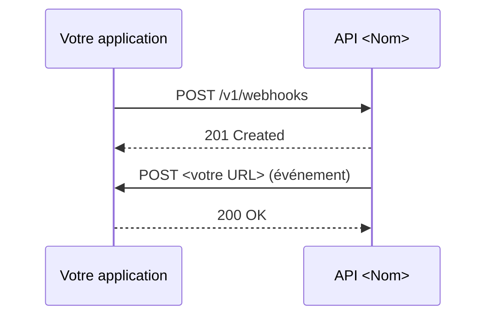

# <Verbe à l'infinitif + objet> (ex. Recevoir des notifications par webhook)

> **Objectif** : <résultat concret obtenu à la fin du guide>.
> **Durée estimée** : <x> min · **API concernées** : <liste>

## Quand utiliser ce guide

<Contexte métier en 2-3 phrases. Préciser ce que ce guide ne couvre pas et renvoyer vers la bonne page.>

## Prérequis

- Avoir suivi le [Quickstart](quickstart.md).
- Scopes : `<scope>`.
- <Autre prérequis technique>.

## Vue d'ensemble

<Schéma de séquence ou liste numérotée des échanges entre les acteurs.>



## Étape 1 — <Action>

<Explication courte.>

```bash
# Exemple de code
```

## Étape 2 — <Action>

<Explication courte.>

```bash
# Exemple de code
```

## Étape 3 — Vérifier le résultat

<Comment l'utilisateur sait que ça marche.>

## Bonnes pratiques

- <Idempotence, retries, sécurité, performance…>

## Dépannage

| Symptôme | Cause | Solution |
|---|---|---|
| | | |

## Pour aller plus loin

- [Référence : <ressource>](reference-endpoint.md)
- [Concept : <concept lié>](<lien>)
